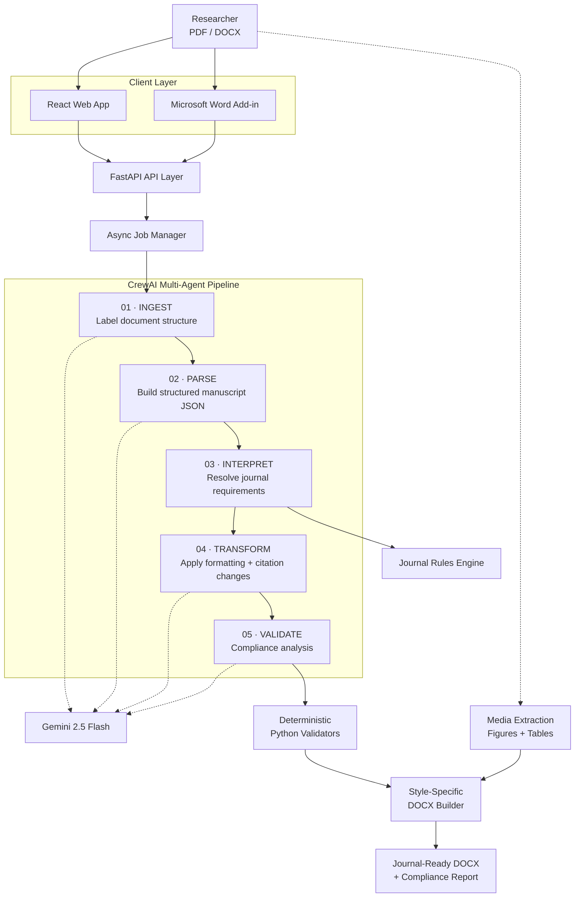

<div align="center">

# Agent PaperPal

### From raw manuscript to journal-ready document — through a coordinated multi-agent AI workflow.

A full-stack manuscript formatting system that analyzes research papers, interprets journal requirements, applies formatting corrections, converts citations, and generates a scored compliance report.

**Runner-Up — HackaMined 2026 · Cactus Communications / Paperpal Track**

[Live Demo](https://agent-paperpal.vercel.app/) · [Architecture](#architecture) · [How It Works](#how-it-works) · [Run Locally](#run-locally)

</div>

---

## Why Agent PaperPal?

Submitting the same research paper to a different journal often means manually rebuilding its formatting:

- citation and reference styles
- heading hierarchies
- abstract requirements
- figure and table conventions
- document layout
- journal-specific rules

A single journal can introduce dozens of formatting requirements, and checking them manually is repetitive and error-prone.

**Agent PaperPal turns that process into an automated document-engineering pipeline.**

Upload a PDF or DOCX, choose a target journal style, and the system coordinates specialized AI agents with deterministic validation and document-processing tools to produce a formatted manuscript and compliance report.

---

## Product Preview

<!-- Replace this block with your best screenshot or demo GIF -->

<p align="center">
  
</p>

> **Tip:** A 10–20 second GIF showing upload → processing → compliance report → generated document will be more effective here than multiple screenshots.

---

## What It Does

| Capability | Implementation |
|---|---|
| **Multi-Agent Formatting** | 5 sequential CrewAI agents analyze, interpret, transform, and validate manuscripts |
| **Journal Styles** | APA 7, IEEE, Vancouver, Springer, and Chicago 17 |
| **Citation Conversion** | Converts citations and references between journal conventions |
| **Compliance Analysis** | Weighted scoring across citations, references, headings, document structure, abstract, figures, and tables |
| **Deterministic Validation** | Python checks validate requirements that should not depend solely on LLM judgement |
| **Document Generation** | Style-specific DOCX builders generate formatted manuscripts |
| **Async Processing** | Long-running formatting jobs execute in the background with progress polling |
| **Document Preview** | Generated DOCX files can be previewed as HTML and edited through TipTap |
| **Media Preservation** | Figures and tables are extracted separately from the LLM pipeline |
| **Word Integration** | Microsoft Word Add-in provides the workflow directly inside Word |

---

## Architecture



The system deliberately separates **probabilistic reasoning** from operations that can be verified deterministically.

LLMs handle tasks such as manuscript interpretation and transformation reasoning, while Python validators, document parsers, rule files, media extraction, and style-specific builders handle operations where deterministic behavior is preferable.

---

## The Five-Agent Pipeline

### `01 / INGEST`

Converts raw manuscript content into structurally labelled blocks such as titles, headings, abstracts, citations, references, figures, and tables.

### `02 / PARSE`

Transforms labelled content into a structured manuscript representation containing metadata, authors, sections, citations, and references.

### `03 / INTERPRET`

Loads the selected journal rules and determines the formatting requirements relevant to the manuscript.

Supports:

- standard journal profiles
- semi-custom rule overrides
- full-custom uploaded guidelines

### `04 / TRANSFORM`

Compares manuscript structure against the target rules and generates transformations including citation conversion, reference formatting, heading changes, and DOCX instructions.

### `05 / VALIDATE`

Evaluates the transformed document across seven compliance dimensions and combines AI analysis with deterministic checks to produce the final compliance report.

---

## Engineering Highlights

### AI where reasoning helps. Code where certainty matters.

Rather than asking an LLM to decide everything, Agent PaperPal combines agentic reasoning with deterministic software components.

Seven Python-level validation checks cover requirements including:

- abstract word limits
- citation formatting
- reference ordering
- citation/reference consistency
- DOI formatting
- `et al.` conventions
- ampersand usage

These checks can override corresponding LLM-generated compliance assessments.

### Asynchronous pipeline execution

Formatting a full manuscript requires several dependent AI and document-processing stages.

Instead of holding an HTTP request open, formatting runs as a background job:

```text
POST /format
     │
     ├── returns job_id
     │
     ▼
Background Pipeline
     │
     ├── INGEST
     ├── PARSE
     ├── INTERPRET
     ├── TRANSFORM
     └── VALIDATE
     │
     ▼
GET /format/status/{job_id}
     │
     ▼
GET /format/result/{job_id}
```

The frontend polls job status and displays pipeline progress to the user.

### Content-addressed caching

Pipeline inputs are hashed using **SHA-256**.

Identical submissions can reuse previously computed pipeline results rather than repeating expensive processing.

### Media bypasses the LLM

Images and tables are extracted through a separate binary-processing path using:

- PyMuPDF
- pdfplumber
- python-docx

This avoids unnecessarily sending binary document content through the language-model workflow and helps preserve document fidelity.

### Style-specific document generation

The output layer contains dedicated builders for:

`APA` · `IEEE` · `Springer` · `Chicago` · `Vancouver` · `Generic`

This allows layout behavior such as columns, headings, references, and document structure to be handled programmatically rather than through prompt instructions alone.

---

## How It Works

```text
                           MANUSCRIPT
                          PDF / DOCX
                               │
                               ▼
                      Extract + Structure
                               │
                               ▼
                    ┌─────────────────────┐
                    │   Agent Pipeline    │
                    │                     │
                    │      INGEST         │
                    │         ↓           │
                    │       PARSE         │
                    │         ↓           │
                    │     INTERPRET       │
                    │         ↓           │
                    │     TRANSFORM       │
                    │         ↓           │
                    │      VALIDATE       │
                    └──────────┬──────────┘
                               │
                ┌──────────────┴──────────────┐
                │                             │
                ▼                             ▼
       Deterministic Checks             Media Extraction
                │                             │
                └──────────────┬──────────────┘
                               ▼
                      Style-Specific DOCX
                               │
                               ▼
                  FORMATTED MANUSCRIPT
                           +
                    COMPLIANCE REPORT
```

---

## Compliance Scoring

Agent PaperPal evaluates manuscripts across seven weighted dimensions:

| Dimension | Weight |
|---|---:|
| Citations | 25% |
| References | 25% |
| Headings | 15% |
| Document Formatting | 10% |
| Abstract | 10% |
| Figures | 7.5% |
| Tables | 7.5% |

The resulting report identifies violations, applied changes, and the manuscript's final compliance score.

---

## Supported Formatting Modes

### Standard

Uses predefined journal rules directly.

### Semi-Custom

Starts from a journal profile while allowing users to override selected formatting requirements.

### Full-Custom

Accepts uploaded journal guideline documents and derives formatting requirements from them.

---

## Tech Stack

### Frontend

`React 19` · `Vite` · `Tailwind CSS` · `Axios` · `TipTap`

### Backend

`Python` · `FastAPI` · `Uvicorn`

### Agentic AI

`CrewAI` · `Google Gemini 2.5 Flash`

### Document Engineering

`PyMuPDF` · `pdfplumber` · `python-docx` · `Mammoth`

### Integration

`Office.js` · `Microsoft Word Add-in`

### Validation & Processing

`JSON Schema` · `BeautifulSoup` · `SHA-256 caching`

---

## API Surface

The backend exposes the complete manuscript-processing workflow through REST APIs.

```text
POST   /upload
POST   /score/pre
POST   /format

GET    /format/status/{job_id}
GET    /format/result/{job_id}

GET    /download/{filepath}
GET    /preview/{filepath}
```

For detailed request/response documentation, see [`backend/README.md`](backend/README.md).

---

## Repository Structure

```text
agent-paperpal/
│
├── backend/
│   ├── agents/              # Five CrewAI agents
│   ├── engine/              # Rule and formatting engine
│   ├── tools/               # Document + validation utilities
│   ├── rules/               # Journal rule definitions
│   ├── schemas/             # Validation schemas
│   ├── crew.py              # Pipeline orchestration
│   └── main.py              # FastAPI application
│
├── frontend/
│   └── src/
│       └── components/      # Web application UI
│
├── word-addin/
│   └── src/                 # Microsoft Word integration
│
└── README.md
```

Detailed implementation documentation lives inside each subsystem.

---

## Run Locally

### 1. Clone

```bash
git clone https://github.com/HimanshuMishra-03/agent-paperpal.git
cd agent-paperpal
```

### 2. Configure the backend

```bash
cd backend
python -m venv .venv
```

Activate the environment and install dependencies:

```bash
pip install -r requirements.txt
```

Create your environment configuration:

```bash
cp .env.example .env
```

Add the required Gemini API credentials to `.env`.

Start FastAPI:

```bash
uvicorn main:app --reload
```

The backend will run on:

```text
http://localhost:8000
```

### 3. Start the frontend

From another terminal:

```bash
cd frontend
npm install
npm run dev
```

Follow the URL printed by Vite.

> The Word Add-in requires additional Office.js and HTTPS development configuration. See [`word-addin/README.md`](word-addin/README.md).

---

## Security & Reliability

The application includes several safeguards around uploaded documents and AI-generated output:

- file extension and size validation
- extracted-text sanity checks
- temporary upload lifecycle management
- isolated per-run output directories
- structured JSON validation
- deterministic post-processing
- controlled journal-rule sources
- automatic temporary-file cleanup

Secrets are loaded through environment variables and are not stored in the repository.

---

## Built at HackaMined 2026

Agent PaperPal was developed for the **Cactus Communications / Paperpal by Editage** track at HackaMined 2026.

**Result: Runner-Up**

The project explored a broader question than manuscript formatting alone:

> How can agentic AI be combined with deterministic software systems to automate complex document workflows without treating the LLM as the source of truth for everything?

That design principle shaped the architecture of Agent PaperPal.

---

## Roadmap

Some directions worth exploring further:

- persistent job storage and distributed workers
- vector-based retrieval for large journal guideline libraries
- expanded journal coverage
- richer Word Add-in editing workflows
- automated regression suites for formatting rules
- cloud object storage for generated documents
- improved observability across agent execution
- collaborative manuscript review

---

## Contributors

Built by the Agent PaperPal team for HackaMined 2026.

If you worked on this project, add the actual contributors here rather than presenting it as a solo project.

---

<div align="center">

### Research formatting shouldn't be the hardest part of research.

Built with Python, FastAPI, CrewAI, Gemini and React.

</div>
